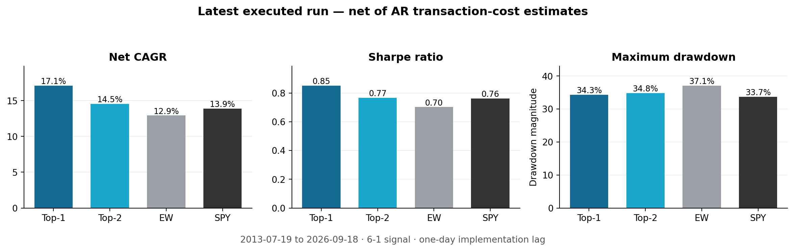
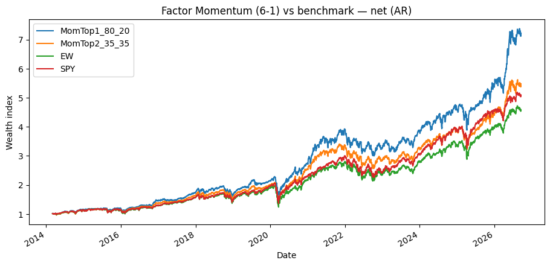
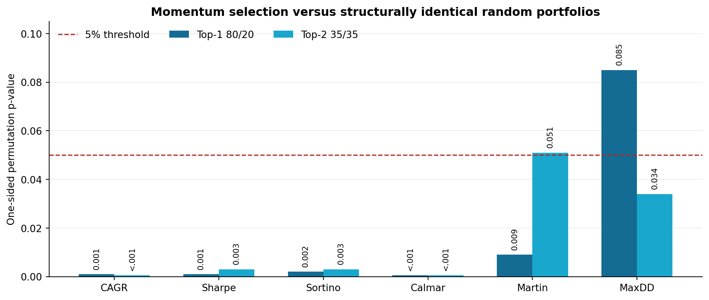
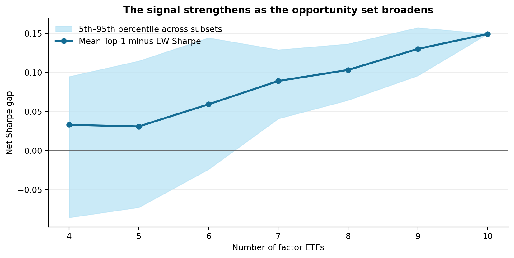
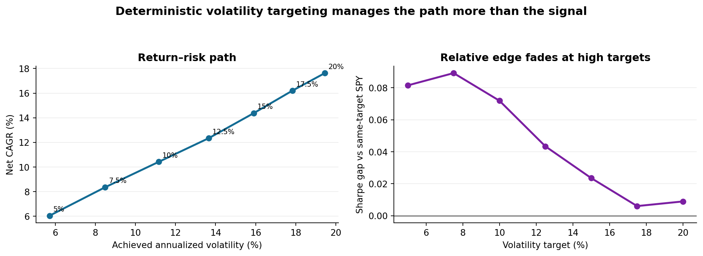

# Cross-Sectional Factor Momentum

> A next-day, cost-aware rotation strategy across investable US equity factor ETFs, tested with signal-permutation nulls, dependence-aware bootstraps, Newey–West spanning regressions, walk-forward model selection and data-snooping controls.

[](https://www.python.org/)
[](Factor_Momentum.ipynb)
[](LICENSE)

**Notebook:** [Factor_Momentum.ipynb](Factor_Momentum.ipynb) · **Frozen run:** [results/run_2026-09-18.json](results/run_2026-09-18.json) · **Full results:** [docs/RESULTS.md](docs/RESULTS.md) · **Research design:** [docs/RESEARCH_DESIGN.md](docs/RESEARCH_DESIGN.md)

## Executive result

The project asks whether the factor-momentum effect documented by Arnott et al. survives translation into a **tradable long-only ETF portfolio**. The latest executed run uses ten US factor ETFs, monthly 6-1 momentum, a genuine one-trading-day implementation lag, historical cash returns and transaction-cost estimates.

> **Bottom line:** broadening the opportunity set from five to ten factors changes the result. The Top-1 signal becomes clearly informative relative to structurally identical random portfolios and beats equal weight under data-snooping controls. It also produces a positive **2.82% annualized net spanning alpha**, although the corresponding Newey–West statistic remains suggestive rather than conventionally significant (t = 1.51, two-sided p = 0.132). The evidence supports **selection skill and a breadth effect**; it does not establish robust risk-adjusted dominance over SPY.

### Latest run at a glance

Reference configuration: **2013-07-19 to 2026-09-18**, 3,156 strategy observations, 6-1 signal, one-day implementation lag, historical `DGS3MO` cash rate, Abdi–Ranaldo transaction-cost proxy.

| Net result | Top-1 80/20 | Top-2 35/35 | Equal weight | SPY |
|---|---:|---:|---:|---:|
| CAGR | **17.10%** | 14.54% | 12.93% | 13.88% |
| Annualized volatility | 19.03% | 18.00% | 17.51% | 17.18% |
| Sharpe ratio | **0.851** | 0.766 | 0.702 | 0.761 |
| Maximum drawdown | -34.29% | -34.82% | -37.09% | **-33.72%** |
| Martin ratio | **2.195** | 1.803 | 1.692 | 1.894 |



The Top-1 strategy compounds to roughly 7.4× over the strategy window versus approximately 5.1× for SPY and 4.7× for the equal-weight factor blend. The endpoint is strong, especially in 2026, so the inferential tests below matter more than the terminal wealth ranking alone.



## What is original here

This is not presented as a new discovery of factor momentum. Its contribution is the **theory-to-implementation and attribution exercise**:

- translate a cross-sectional academic signal into monthly, long-only ETF portfolios;
- enforce genuine next-day implementation and drifting weights between rebalances;
- charge security-level costs against drifted pre-trade weights;
- separate signal skill from the concentration structure using a random-selection null;
- distinguish dynamic selection from static factor and market exposures through spanning and replication;
- test whether the result depends on factor-universe breadth;
- subject specification search to White Reality Check, Hansen SPA and walk-forward selection;
- compare ordinary block resampling with volatility- and lead/lag-aware engines;
- test whether volatility targeting and a Low-Vol sleeve improve the signal or merely reshape common equity beta.

## Portfolio construction

### Investable universe

The reference run activates one liquid US equity ETF per systematic theme:

| Theme | ETF | Theme | ETF |
|---|---|---|---|
| Value | `VLUE` | Dividend yield | `VYM` |
| Size | `SIZE` | High beta | `SPHB` |
| Momentum | `MTUM` | Growth | `IWF` |
| Quality | `QUAL` | Buyback | `PKW` |
| Low volatility | `USMV` | Equal-weight equity | `RSP` |

The common-data requirement makes the usable sample start in July 2013. `SPY` is the passive market benchmark and is not part of the cross-sectional ranking.

### Signal and weights

At each month-end, factor \(i\) receives the signal

\[
s_{i,t}^{(6-1)} = \sum_{k=21}^{146}\log(1+r_{i,t-k}),
\]

which uses 126 daily log returns ending 21 trading days before the signal date. A 12-1 alternative uses a 252-day formation window with the same 21-day skip.

- **Top-1 80/20:** 80% in the highest-ranked factor; 20% equally divided among the rest.
- **Top-2 35/35:** 35% in each of the top two; the residual 30% divided among the rest.
- **Rank / quantile and inverse-volatility variants:** distinguish selection from arbitrary concentration.
- **Equal weight:** active factor-blend benchmark.

Signal at month-end close → trade at the following trading-day close → new weights begin earning one day later. The portfolio drifts naturally between rebalances.

### Costs and cash

- historical daily risk-free rate: FRED `DGS3MO`, lagged one day;
- fallback chain: Yahoo `^IRX`, then zero only if neither source is available;
- one-way cost proxies: Abdi–Ranaldo and Corwin–Schultz, plus a fixed-bps sensitivity;
- primary AR estimates: approximately 15–28 bps per ETF per trade;
- Top-1 two-way turnover: approximately 5.23× per year;
- estimated Top-1 drag under AR: approximately 40 bps per year.

## Evidence that the signal contains information

The signal-permutation null holds the mechanics fixed—same concentration, dates, costs and timing—but randomizes the selected factor. This isolates **selection** from simply running a concentrated portfolio.

| One-sided permutation p-value | Top-1 | Top-2 |
|---|---:|---:|
| CAGR | **0.001** | **<0.001** |
| Sharpe | **0.001** | **0.003** |
| Sortino | **0.002** | **0.003** |
| Calmar | **<0.001** | **<0.001** |
| Martin | **0.009** | 0.051 |
| Maximum drawdown | 0.085 | **0.034** |



The selection diagnostic explains why the result is not purely defensive. The Top-1 signal chooses the subsequent best factor in **19.9%** of months, almost twice the random 10% rate, but also chooses the subsequent worst factor in **16.6%** of months. It is a **high-variance, tail-seeking momentum mechanism**: genuine winner identification combined with occasional momentum crashes.

## Alpha, multiple testing and out-of-sample evidence

| Test | Result | Interpretation |
|---|---:|---|
| Newey–West spanning alpha, Top-1 | **2.82%/yr**, t = 1.51, p = 0.132 | Economically meaningful; statistically suggestive, not 5% two-sided significant |
| Static-replication fit | corr. 0.941; R² = 0.886 | A large share is static factor/market exposure, but actual Sharpe exceeds the static replica (0.851 vs 0.747) |
| White Reality Check vs EW | **p = 0.026** | Best mean-return specification survives search correction |
| Hansen SPA vs EW | **p = 0.025** | Multiplicity-robust evidence against equal weight |
| Ledoit–Wolf ΔSharpe vs EW | +0.149; p = 0.175 | Realized Sharpe lead is not statistically decisive |
| Ledoit–Wolf ΔSharpe vs SPY | +0.090; p = 0.445 | No robust risk-adjusted market dominance |
| Walk-forward selected vs EW | CAGR 18.94% vs 13.94%; Sharpe 0.849 vs 0.679 | Supportive model-selection OOS evidence; see cost-grid caveat below |

The stationary paired bootstrap is deliberately less flattering: `P(Top-1 Sharpe > EW) = 0.234` and `P(Top-1 Sharpe > SPY) = 0.138`. FHS and VAR-sieve simulations reach the same qualitative conclusion. Therefore the defensible claim is:

> **The factor-momentum signal is informative and adds mean return relative to random selection and equal weight; its risk-adjusted superiority over a diversified factor blend or SPY remains unresolved.**

## Breadth is the central empirical finding

The five-factor version was weak and largely spanned. With ten factors, the Top-1 Sharpe rises to 0.851 and its gap over equal weight reaches 0.149. The gap remains positive when any individual ETF is removed, ranging from **0.087 to 0.162**.



The subset experiment shows a rising average gap as the opportunity set expands. Because only 15 random subsets are sampled for most intermediate sizes, this is strong diagnostic evidence rather than a final population statement; an exhaustive subset run is a natural next robustness step.

## Risk overlays: useful, but not a free alpha upgrade

Two transparent overlays are implemented with the same timing and cost discipline:

1. **Deterministic volatility targeting:** 21-day trailing realized volatility, one-day lag, 1.5× leverage cap, exposure-rebalance band and cash earning the historical risk-free rate.
2. **Fixed Low-Vol sleeve:** 20% for Top-1 and 33% for Top-2, blended at the weight level and passed through the same drift-and-cost engine.

The volatility ladder materially improves drawdown control—for example, the 15% target produces approximately 15.9% realized volatility and a -19.9% maximum drawdown—but the Sharpe advantage over **same-target SPY** falls from about 0.08 at low targets to almost zero at 17.5–20%. The overlay is mostly managing common equity exposure, not manufacturing new factor-momentum alpha.



The static Low-Vol sleeve tells the same story: Top-1 Sharpe changes from 0.851 to 0.848, while CAGR falls from 17.10% to 15.85%. Its benefit is modest path smoothing, not a superior risk-adjusted return. A genuinely dynamic FM–LowVol allocation driven by forecast volatility or a probabilistic tail state is the next research extension.

## Validation stack

- **Causal implementation:** one-day trading lag, lagged risk-free rate, no use of entry-day return.
- **Common-sample resampling:** prevents inception-date missingness from fragmenting bootstrap blocks.
- **Stationary bootstrap:** rebuilds signal, portfolios and costs inside every replica.
- **Filtered Historical Simulation:** AR–GJR–GARCH filtering with jointly resampled standardized residuals.
- **VAR-sieve wild bootstrap:** preserves cross-factor lead/lag and heteroskedasticity.
- **Spanning and conditional alpha:** Newey–West standard errors, rolling two-year alpha and volatility-regime interactions.
- **Multiple-testing control:** White Reality Check and Hansen SPA across the specification grid.
- **Universe robustness:** leave-one-out and breadth-gradient experiments.
- **Economic attribution:** static replication, selection-quality ranks, break-even costs and risk-overlay horse races.

## Repository structure

```text
.
├── Factor_Momentum.ipynb          # executed end-to-end reference run
├── core.py                       # reusable research and backtest functions
├── assets/                       # figures displayed in this README
├── results/
│   └── run_2026-09-18.json       # machine-readable frozen run summary
├── scripts/
│   ├── build_readme_assets.py    # regenerates summary figures
│   └── prepare_release_notebook.py
├── docs/
│   ├── RESULTS.md                # complete interpretation of the run
│   ├── RESEARCH_DESIGN.md        # hypotheses, timing and inference map
│   └── CHANGELOG.md
├── requirements.txt
├── .gitignore
└── LICENSE
```

## Reproduce the analysis

```bash
python -m venv .venv
source .venv/bin/activate          # Windows: .venv\Scripts\activate
pip install -r requirements.txt
jupyter lab Factor_Momentum.ipynb
```

The default configuration executes the full 10-factor workflow and is computationally heavy. For a quick smoke test, lower `N_BOOT`, `N_RANDOM`, `ENGINE_N_SIMS` and `MT_N_BOOT`, or switch off the relevant `RUN_*` flags.

Core configuration:

```python
DATA_SOURCE = "yahoo"
VARIANT = "6-1"
IMPLEMENTATION_LAG = 1
USE_EXTENDED_UNIVERSE = True

USE_HISTORICAL_RF = True
RF_SOURCE = "DGS3MO"

RUN_TRANSACTION_COSTS = True
TC_ESTIMATOR = "AR"
TC_FIXED_BPS = 2.0

RUN_BOOTSTRAP = True
RUN_RANDOM_NULL = True
RUN_MULTIPLE_TESTING = True
RUN_WALK_FORWARD = True
RUN_VOL_TARGET = True
RUN_LOWVOL_SLEEVE = True
```

## Interpretation and limitations

- **Short history:** the ten-ETF common sample is roughly thirteen years; results are sensitive to the endpoint and the strong 2026 segment.
- **Long-only vehicles:** ETF returns embed market beta and overlapping style exposures; they are not equivalent to academic long–short factors.
- **Alpha uncertainty:** 2.82% is economically relevant, but p = 0.132 under a two-sided Newey–West test.
- **Sharpe uncertainty:** paired bootstrap and Ledoit–Wolf tests do not establish superior risk-adjusted performance versus EW or SPY.
- **Cost proxies:** OHLC estimators are noisy and probably conservative for liquid ETFs; AR, CS and fixed-bps results are all reported.
- **Walk-forward caveat:** the current grid lets the cost estimator vary along with signal horizon and concentration. The encouraging OOS result is therefore supportive; production validation should fix the economic cost model ex ante and treat the alternatives only as sensitivities.
- **Long–short comparison:** the notebook contains the module, but the reference run could not retrieve Kenneth French data. Supply `LONGSHORT_CSV_PATH` to execute it reproducibly.
- **Secondary inference refresh:** PSR, BCa-Sharpe and DSR callers have been normalized to excess returns; their legacy outputs were cleared and those three cells should be rerun before quoting them.
- **No live-trading claim:** this is a research pipeline and an executed historical experiment, not investment advice.

## References

- Arnott, R., Clements, A., Kalesnik, V., & Linnainmaa, J. (2023). *Factor Momentum*. Review of Financial Studies.
- Gupta, T., & Kelly, B. (2019). *Factor Momentum Everywhere*. Journal of Portfolio Management.
- Ehsani, S., & Linnainmaa, J. (2022). *Factor Momentum and the Momentum Factor*. Journal of Finance.
- Barroso, P., & Santa-Clara, P. (2015). *Momentum Has Its Moments*. Journal of Financial Economics.
- Politis, D. N., & Romano, J. P. (1994). *The Stationary Bootstrap*. JASA.
- Ledoit, O., & Wolf, M. (2008). *Robust Performance Hypothesis Testing with the Sharpe Ratio*. Journal of Empirical Finance.
- White, H. (2000). *A Reality Check for Data Snooping*. Econometrica.
- Hansen, P. R. (2005). *A Test for Superior Predictive Ability*. Journal of Business & Economic Statistics.
- Corwin, S. A., & Schultz, P. (2012). *A Simple Way to Estimate Bid-Ask Spreads from Daily High and Low Prices*. Journal of Finance.
- Abdi, F., & Ranaldo, A. (2017). *A Simple Estimation of Bid-Ask Spreads from Daily Close, High, and Low Prices*. Review of Financial Studies.

## License

MIT. See [LICENSE](LICENSE).
